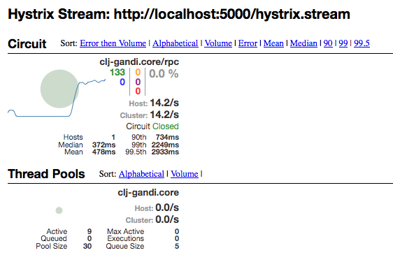

# Clojure wrapper for Gandi.net API

```clojure
[clj-gandi "0.1.3"]
```

## About

**clj-gandi** is a clojure wrapper on [Gandi.net](<https://www.gandi.net/>) XML-RPC [API](<http://doc.rpc.gandi.net/>).

It's designed to maintain a consistent and resilient RPC stream  :

- Use a workers pool based on async channels.
- Compliant with API [rate limits](<http://doc.rpc.gandi.net/overview.html#rate-limit>)
- Auto-requeueing on failure, with loop handling.
- Circuit breaker allowing your application to survive API outages.
- Integrated hystrix metrics server (optional).


## Usage

### developement
```
GANDI_LOG_LEVEL="debug" GANDI_API_KEY="thetestapikey" lein repl
```

### production
```
GANDI_API_KEY="theprodapikey" GANDI_PROD=1 lein run
```

### environment variables

`GANDI_API_KEY` api key, required.  
`GANDI_API_TIMEOUT_MS` rpc calls timeout in milliseconds, defaults to 30s.  
`GANDI_API_RETRY_COUNT` rpc calls retry count when rpc fault or timeout, defaults to 5.  
`GANDI_PROD` use production api, set to 1 for production, use OT&E api if unset or 0.  
`GANDI_LOG_LEVEL` log level, "debug","info","warn","error", defaults to "warn".  

#### Example
```clojure
(ns test
  (require 
  [clj-gandi.core]
  [clj-gandi.hystrix.server]))

;;;launch workers pool, only once !
(defonce gandi-pool (clj-gandi.core/initialize))

;;;launch metrics server for hystrix dashboard / turbine, on port 5000
(clj-gandi.hystrix.server/run 5000)

;;;simple call
(clj-gandi.core/call :version.info)

;;;simple call, 1000 times
(repeatedly 1000 #(clj-gandi.core/call :version.info))

;;;get domains count
(clj-gandi.core/call :domain.count)

;;;get all domains list
(clj-gandi.core/list-all :domain.list)

;;;get all running servers list (does not work on OT&E API)
(clj-gandi.core/list-all :hosting.vm.list {:state "running"})

```

#### API Introspection

Introspection methods have a different prototype, and are rarely used.
Instead of adding extra tests on each api call, specific helpers methods are provided.

```clojure
(clj-gandi.core/methods-list)
(clj-gandi.core/method-help :domain.info)
(clj-gandi.core/method-signature :domain.list)
```

#### (Not a) Benchmark

Latest tests with default config values shows a ~13 req/sec rpc call rate average.
Keep in mind that speed is rate-limited per gandi API policy (30 calls per 2 seconds).




#### Roadmap

- Better unit tests, examples and documentation.
- Improve the API with higher level functions, *à la* [Gandi.cli](https://github.com/Gandi/gandi.cli)

#### Thanks

- To all the *bullshitless* [Gandi](https://www.gandi.net) tech and support team.
- To Joseph Wilk for his inspiring blog entry introducing [using Hystrix with clojure](http://blog.josephwilk.net/clojure/building-clojure-services-at-scale.html)
